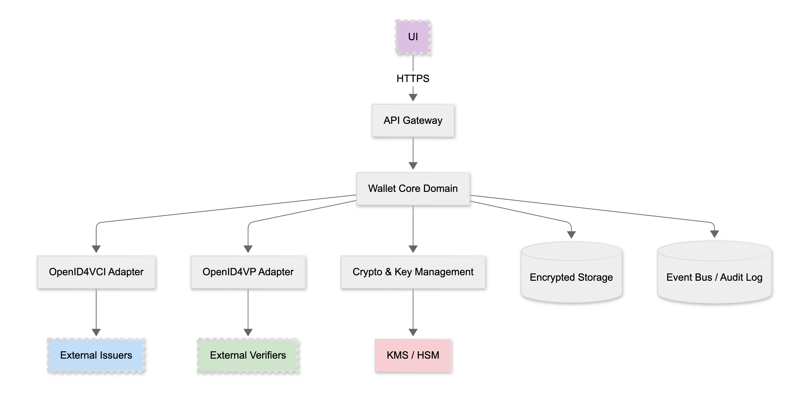

# Cloud Identity Wallet

Cloud Identity Wallet is a flexible, cloud-hosted verifiable credential wallet aligned with SSI/eIDAS/EUDI.
It supports OpenID for Verifiable Credential Issuance (OIDC4VCI) and OpenID for Verifiable Presentations (OIDC4VP), and is designed to support multiple credential types with privacy-preserving disclosure.

> Status: This repository currently contains architecture diagrams and documentation. Rust implementation will be added incrementally.

## Features
- **OIDC4VCI**: Authorization Code and Pre-Authorized Code issuance flows.
- **OIDC4VP**: Presentation to verifiers using authorization requests.
- **Custodial key management**: Server-side keys protected by KMS/HSM with encrypted storage.
- **Audit-ready**: Event bus and audit log integration points.

## Architecture
See docs/architecture.md for details.

High-level component view:



## Getting started

### Prerequisites
- Rust toolchain via rustup (stable)
- Linux or macOS

Install Rust (if needed):

```bash
curl --proto '=https' --tlsv1.2 -sSf https://sh.rustup.rs | sh
rustup default stable
```

### Clone

```bash
git clone <this-repo-url>
cd cloud-identity-wallet
```

### Build, run, test
The commands below reflect the intended developer workflow once code is present. They will be updated as the implementation lands.

```bash
# Build
cargo build

# Run (example)
cargo run --bin wallet

# Tests
cargo test

# Lints & formatting
cargo fmt --all
cargo clippy --all-targets --all-features -- -D warnings
```

## Repository structure
- `docs/Arch-images/` – architecture and protocol flow diagrams used in documentation
- `docs/` – additional documentation (see `docs/architecture.md`)
- `README.md` – this file

## Contributing
We welcome contributions. See [CONTRIBUTING.md](./CONTRIBUTING.md) for guidelines and Rust idioms used in this project.

## License
TBD
