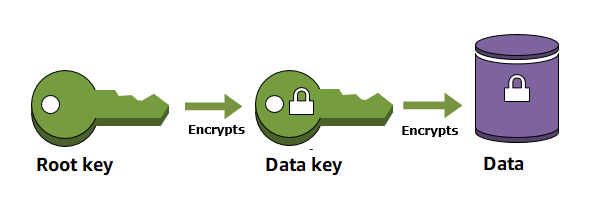

# Cloud Wallet KMS

[](https://github.com/ADORSYS-GIS/cloud-identity-wallet/actions/workflows/ci.yml)
[](https://github.com/ADORSYS-GIS/cloud-identity-wallet)
[](https://github.com/ADORSYS-GIS/cloud-identity-wallet)
[](#license)

A key management library for envelope encryption in the Cloud Identity Wallet ecosystem.

## Architecture

The library follows a standard envelope-encryption model:



1. A Master Key/Root Key protects a Data Encryption Key (DEK).
2. The encrypted DEK is stored via a storage backend.
3. Payload encryption/decryption uses the plaintext DEK.

## Feature Flags

- **`local-kms`**: Enables support for local key management (enabled by default).
- **`aws-kms`**: Enables support for AWS KMS for master key and data encryption key lifecycles.
- **`memory-backend`**: Enables support for in-memory storage of Data encryption keys (enabled by default).
- **`sqlite`**: Enables support for SQLite database storage of Data encryption keys.
- **`postgres`**: Enables support for PostgreSQL database storage of Data encryption keys.
- **`mysql`**: Enables support for MySQL database storage of Data encryption keys.

## Installation

Default setup (local provider + in-memory storage):

```toml
[dependencies]
cloud-wallet-kms = "0.1"
```

AWS + PostgresSQL example:

```toml
[dependencies]
cloud-wallet-kms = { version = "0.1", default-features = false, features = ["aws-kms", "postgres"] }
```

## Quick Start (Local Provider + SQLite database storage backend)

Requires the **`sqlite`** feature flag.

```rust
use cloud_wallet_kms::provider::{LocalProvider, Provider};
use cloud_wallet_kms::storage::SqlxBackend;
use sqlx::any::AnyPoolOptions;

async fn setup_storage() -> cloud_wallet_kms::Result<SqlxBackend> {
    // Install default drivers for SQLite
    sqlx::any::install_default_drivers();

    // Create a connection pool to the SQLite database
    let pool = AnyPoolOptions::new()
        .max_connections(1)
        .connect("sqlite::memory:")
        .await?;

    let storage = SqlxBackend::new(pool);
    // Initialize the database schema
    storage.init_schema().await?;

    Ok(storage)
}

#[tokio::main]
async fn main() -> cloud_wallet_kms::Result<()> {
    let storage = setup_storage().await?;
    let provider = LocalProvider::with_storage(storage);
    let aad = b"tenant:wallet1";
    let mut payload = b"secret payload".to_vec();

    provider.encrypt(aad, &mut payload).await?;
    let plaintext = provider.decrypt(aad, &mut payload).await?;

    assert_eq!(plaintext, b"secret payload");
    Ok(())
}
```

## AWS KMS Provider

```rust,ignore
use aws_config::{BehaviorVersion, Region};
use cloud_wallet_kms::provider::{AwsProvider, Provider};
use cloud_wallet_kms::storage::InMemoryBackend;

async fn aws_roundtrip() -> cloud_wallet_kms::Result<()> {
    let config = aws_config::defaults(BehaviorVersion::latest())
        .region(Region::new("us-east-1"))
        .load()
        .await;

    let storage = InMemoryBackend::new();
    let provider = AwsProvider::new(&config, "server.example.com", storage)
        .with_encryption_context("tenant", "wallet1");

    let aad = b"tenant:wallet1";
    let mut payload = b"sensitive value".to_vec();

    provider.encrypt(aad, &mut payload).await?;
    let plaintext = provider.decrypt(aad, &mut payload).await?;

    assert_eq!(plaintext, b"sensitive value");
    Ok(())
}
```

## Security Notes

The local KMS provider is intended for development/testing and keeps key material local.

## Testing

Run default-feature tests:

```bash
cargo test -p cloud-wallet-kms
```

Run full feature matrix:

```bash
cargo test -p cloud-wallet-kms --all-features
```

**Note**: Some integration tests use Testcontainers and require a working Docker daemon. When Docker is unreachable, the Docker-backed tests return early instead of panicking so local development on Docker-less machines can still run the rest of the suite.

## Contributing

Contributions are welcome. See [CONTRIBUTING.md](../CONTRIBUTING.md).

## License

Licensed under either of [Apache License, Version 2.0](../LICENSE-APACHE) or [MIT license](../LICENSE-MIT) at your option.

Unless you explicitly state otherwise, any contribution intentionally submitted for inclusion in this project by you, as defined in the Apache-2.0 license, shall be dual licensed as above, without any additional terms or conditions.
