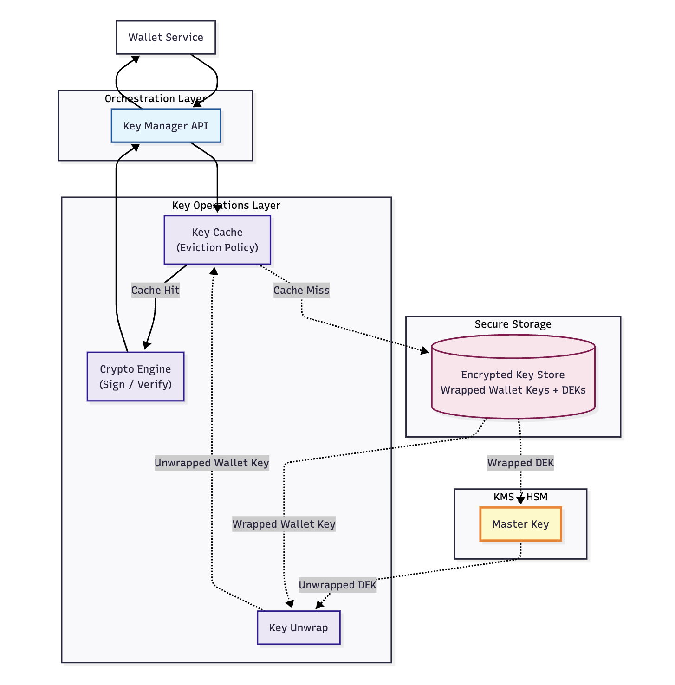

# Architecture

Cloud Identity Wallet is a cloud-hosted verifiable credential wallet aligned with SSI/eIDAS/EUDI. It implements OpenID4VCI for issuance and OpenID4VP for presentation, with custodial key management backed by [KMS](https://www.thesslstore.com/blog/what-is-a-key-management-service-key-management-services-explained/)/[HSM](https://en.wikipedia.org/wiki/Hardware_security_module).

## High-level component diagram

### Components

- **UI**: End-user web/mobile interface to accept offers, review disclosures, consent; display credentials; and manage credential lifecycle (view, delete).
- **API Gateway**: Public HTTP endpoints, authentication, rate limiting, request routing.
- **Wallet Core Domain**: Business logic for offers, credential storage, presentation building, lifecycle.
- **OpenID4VCI Adapter**: Outbound client to Issuers for credential issuance.
- **OpenID4VP Adapter**: Outbound client to Verifiers for presentation/verification.
- **Crypto & Key Management**: Abstractions over KMS/HSM for signing/encryption and key lifecycle.
- **Encrypted Storage**: Encrypted database/object store for credentials and metadata.
- **Event Bus / Audit Log**: Append-only auditing and integration hooks.

## Key management design

Custodial keys are protected by KMS/HSM. Wallet keys and Data Encryption Keys (DEKs) are wrapped at rest and unwrapped at use-time.

Key ideas:

- **Key Manager API** mediates signing and verification.
- **Key Cache** with eviction policy minimizes unwrapping operations.
- **Secure Storage** contains only wrapped wallet keys and DEKs.
- **KMS/HSM** holds the master key used to wrap/unwrap DEKs; wallet service never learns the master key.

## Protocol flows

### Issuance – Authorization Code (OIDC4VCI)

Summary:

- Resolve credential offer and issuer metadata.
- Run OAuth 2.0 authorization code flow to obtain access token.
- `POST /credential` with proofs to receive credential(s); validate and store.

### Issuance – Pre‑Authorized Code (OIDC4VCI)

Summary:

- Resolve out-of-band `credential_offer` and issuer metadata.
- Exchange `pre_authorized_code` (and optional `tx_code`) for access token.
- `POST /credential`; validate and store.

### Presentation – OIDC4VP

Summary:

- Verifier presents a `request_uri` to an Authorization Request Object (JWT).
- Wallet builds a verifiable presentation and returns a VP Token in the authorization response.

## Security and privacy

- Minimize disclosure; support selective disclosure-friendly credential formats.
- Explicit consent surfaces and audit trails for issuance/presentation.
- Per-user isolation, rate limiting, and telemetry.
- Secrets at rest are wrapped; in memory handled using secret types with zeroize.

## Future work

- Incremental Rust implementation of the wallet service, adapters, and storage.
- Conformance tests against OpenID4VCI/OpenID4VP reference suites.
