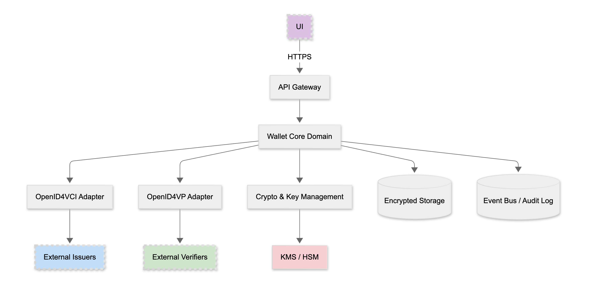
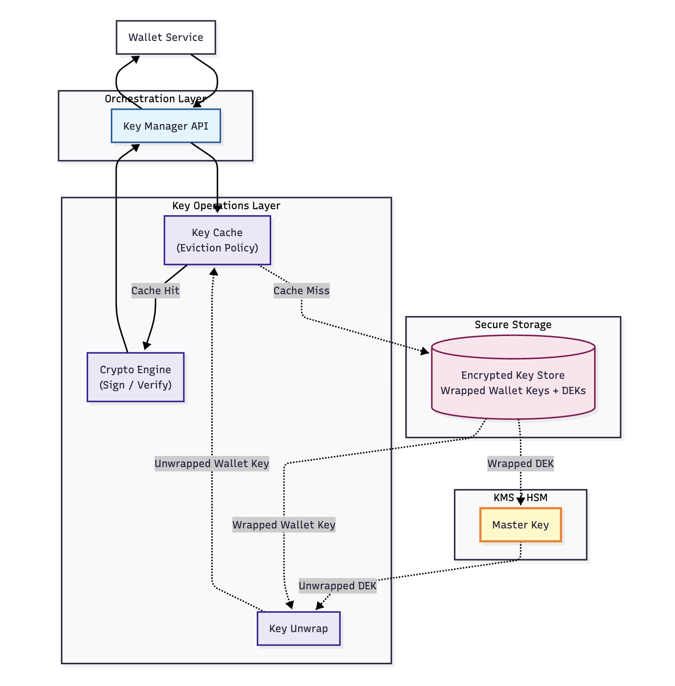
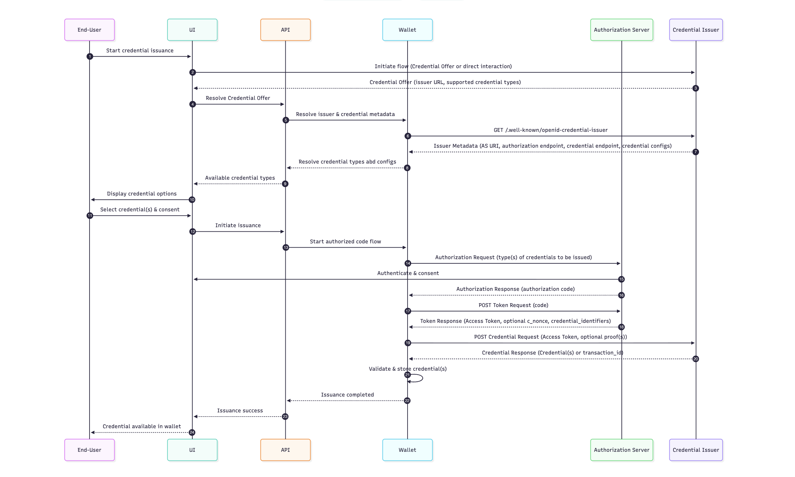
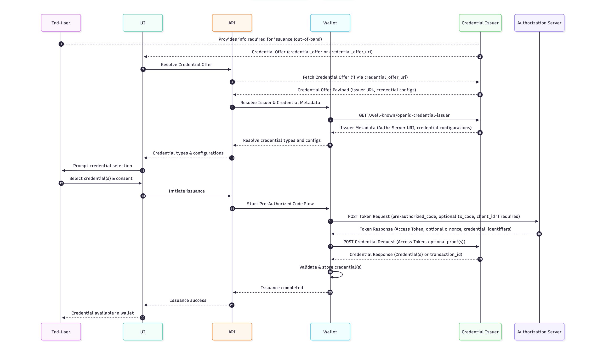
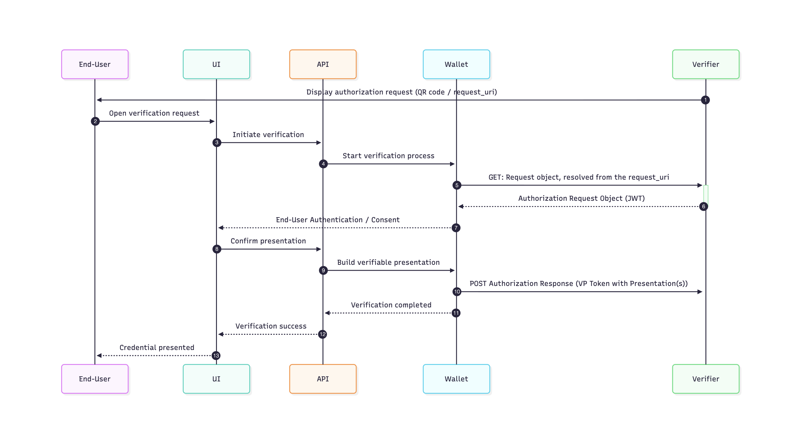

# Architecture Overview — cloud-identity-wallet

## System Overview

Cloud Identity Wallet is a cloud-hosted, multi-tenant verifiable credential wallet aligned with SSI/eIDAS/EUDI. It implements [OpenID4VCI](https://openid.net/specs/openid-4-verifiable-credential-issuance-1_0.html) for issuance and [OpenID4VP](https://openid.net/specs/openid-4-verifiable-presentations-1_0.html) for presentation, with custodial key management backed by KMS/HSM.

**Architecture Type**: Split wallet architecture with remote backend API

- **UI Client** (web/native): User interaction, consent, credential selection
- **Remote Wallet Backend API**: Protocol handling, storage, key management, proofs

## Component Diagram

## Key Components

### In Wallet Scope

| Component                    | Responsibility                                                                                      | Tech Stack |
|------------------------------|------------------------------------------------------------------------------------------------------|------------|
| **UI (External)**            | End-user web/mobile interface for offers, disclosures, consent; credential display and lifecycle management | External   |
| **API Gateway**              | Public HTTP endpoints, authentication, request routing                                              | Axum       |
| **Wallet Core Domain**       | Business logic for offers, credential storage, presentation building                                 | Rust       |
| **OpenID4VCI Adapter**       | Outbound client to Issuers for credential issuance                                                   | Rust       |
| **OpenID4VP Adapter**        | Outbound client to Verifiers for presentation/verification                                            | Rust       |
| **Crypto & Key Management**  | Abstractions over KMS/HSM for signing/encryption and key lifecycle                                    | Rust       |
| **Encrypted Storage**        | Encrypted database/object store for credentials and metadata                                          | Rust       |
| **Event Bus / Audit Log**    | Append-only auditing and integration hooks                                                            | Rust       |

### Out of Scope (Ecosystem Actors)

| Component                      | Notes                                                                         |
|--------------------------------|-------------------------------------------------------------------------------|
| External Issuers               | Not hosted by wallet                                                          |
| External Verifiers             | Not hosted by wallet                                                          |
| Revocation/Status Lists        | Issuer/verifier responsibility; wallet may only need client capability for status checking |
| Trust establishment frameworks | Explicitly out-of-scope for prototype                                         |

## Key Management Design

Custodial keys are protected by KMS/HSM. Wallet keys and Data Encryption Keys (DEKs) are wrapped at rest and unwrapped at use-time.

Key ideas:

- **Key Manager API** mediates signing, verification, encryption, and decryption operations.
- **Key Cache** with eviction policy minimizes unwrapping operations and increases throughput.
- **Secure Storage** contains only wrapped wallet keys and DEKs.
- **KMS/HSM** holds the master key used to wrap/unwrap DEKs; wallet service never learns the master key.

## Protocol Flows

### Issuance – Authorization Code (OpenID4VCI)

Summary:

1. Resolve credential offer and issuer metadata.
2. Run OAuth 2.0 authorization code flow to obtain access token.
3. `POST /credential` with proofs to receive credential(s); validate and store.

### Issuance – Pre-Authorized Code (OpenID4VCI)

Summary:

1. Resolve out-of-band `credential_offer` and issuer metadata.
2. Exchange `pre-authorized_code` (and optional `tx_code`) for access token.
3. `POST /credential`; validate and store.

### Presentation – OpenID4VP

Summary:

1. Verifier presents a `request_uri` to an Authorization Request Object (JWT).
2. Wallet builds a verifiable presentation and returns a VP Token in the authorization response.

## Key Design Decisions

| Decision | Rationale | Status |
|----------|-----------|--------|
| Split wallet architecture | Distinct UI actor with explicit user consent/selection steps; backend responsible for protocol interactions, storage, proofs, and key usage | Accepted |
| Feature-gated dependencies | Heavy dependencies (e.g., jsonschema) should be feature-gated; default build should be lightweight | Accepted |
| OIDC protection for API | Deemed excessive for prototype timeline; pragmatic API protection strategy chosen | Accepted |

## Security Architecture

- Minimize disclosure; support selective disclosure-friendly credential formats.
- Explicit consent surfaces and audit trails for issuance/presentation.
- Per-user isolation, rate limiting, and telemetry.
- Secrets at rest are wrapped; in memory handled using secret types with secure erasure.

## Roadmap

1. **Architecture clarification**: Add legend/definitions and scope boundaries; strengthen links between adapters, credential lifecycle, encrypted storage, and key management.
2. **Flow completeness**: Issuance: model UI initiation, token acquisition, nonce endpoint, multi-credential offers; Verification: keep distinct UI actor.
3. **Prototype security approach**: Pragmatic API protection strategy suitable for early delivery.
4. **Incremental implementation**: Implement storage, lifecycle, and key management first; integrate protocol adapters (OpenID4VCI, OpenID4VP); add status checking client capability if needed.
