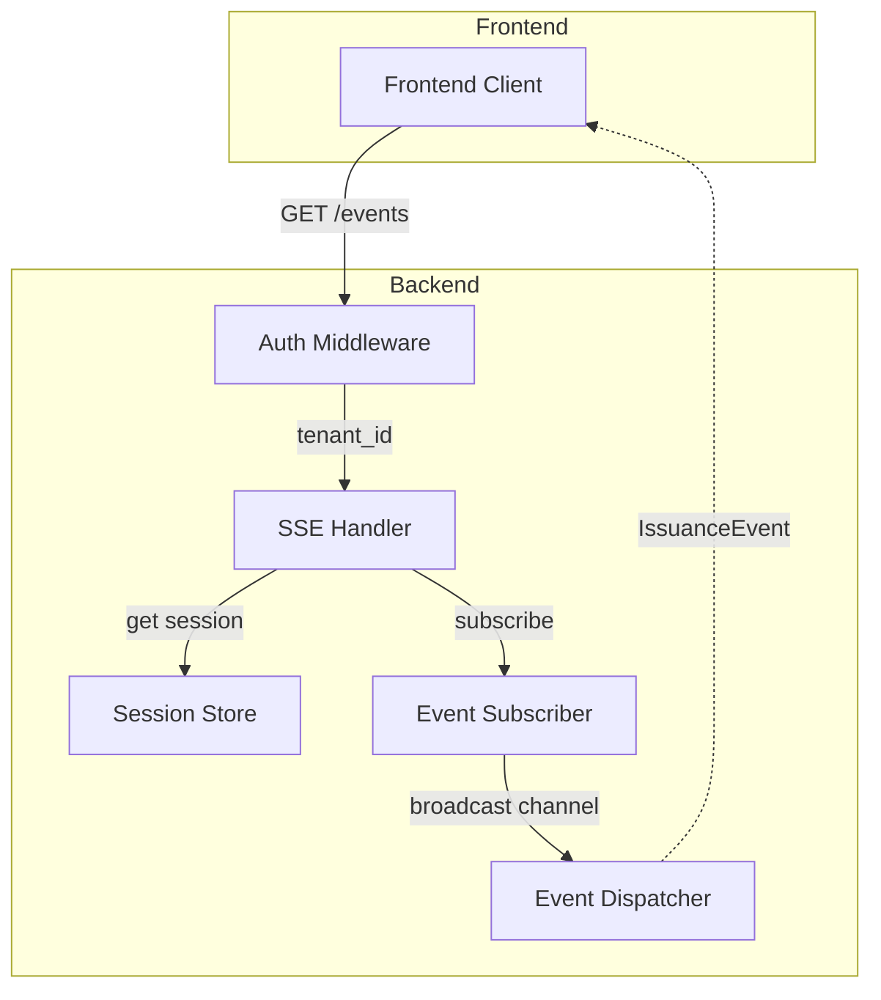
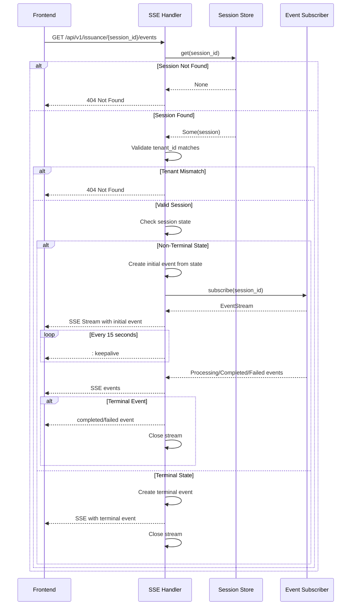

# Implementation Plan: SSE Events Endpoint

**Ticket**: GET /api/v1/issuance/{session_id}/events #149

## Overview

Implement a Server-Sent Events (SSE) stream endpoint that pushes all session state transitions to the frontend in real time. The frontend opens this stream after `/consent` and keeps it open until a terminal event (`completed` or `failed`) is received.

## File Structure

```
src/server/handlers/
├── health.rs
├── root.rs
├── tenant.rs
├── issuance/           # NEW: issuance handlers module
│   ├── mod.rs         # Module exports
│   └── events.rs      # SSE events handler
└── mod.rs              # Updated to include issuance module
```

## Architecture Analysis

### Existing Components

1. **Event System** ([`src/domain/models/issuance/events.rs`](src/domain/models/issuance/events.rs:1))
   - `IssuanceEvent` enum with `Processing`, `Completed`, `Failed` variants
   - `to_sse_event()` method converts to Axum SSE `Event` format
   - `is_terminal()` method identifies completion/failure events

2. **Event Publisher/Subscriber Traits** ([`src/domain/ports.rs`](src/domain/ports.rs:71))
   - `IssuanceEventPublisher` - publishes events
   - `IssuanceEventSubscriber` - subscribes to session events
   - Returns `IssuanceEventStream` (pinned async stream)

3. **In-Memory Implementation** ([`src/outbound/event_dispatch.rs`](src/outbound/event_dispatch.rs:185))
   - `MemoryEventPublisher` / `MemoryEventSubscriber` using `tokio::sync::broadcast`
   - `event_stream_to_sse()` helper for Axum SSE conversion

4. **Session Management** ([`src/session/data.rs`](src/session/data.rs:1))
   - `IssuanceSession` with `state: IssuanceState`
   - States: `AwaitingConsent`, `AwaitingAuthorization`, `AwaitingTxCode`, `Processing`, `Completed`, `Failed`
   - `is_terminal()` method on state

5. **Authentication** ([`src/server/auth/mod.rs`](src/server/auth/mod.rs:1))
   - JWT bearer token validation
   - Extracts `tenant_id` into request extensions

6. **Error Handling** ([`src/server/error.rs`](src/server/error.rs:1))
   - `ApiError` with RFC 7807 shape
   - `IntoApiError` trait for domain error conversion

### Component Diagram



## Implementation Plan

### 1. Update Service to Include Event Subscriber

**File**: [`src/domain/service.rs`](src/domain/service.rs:1)

Add `IssuanceEventSubscriber` to the `Service` struct:

```rust
use crate::domain::ports::{IssuanceEventSubscriber, TenantRepo};

#[derive(Clone)]
pub struct Service<S> {
    pub session: S,
    pub tenant_repo: Arc<dyn TenantRepo>,
    pub issuance_engine: IssuanceEngine,
    pub event_subscriber: Arc<dyn IssuanceEventSubscriber>,  // NEW
}
```

### 2. Create SSE Handler Module

**File**: `src/server/handlers/issuance.rs` (new file)

```rust
//! HTTP handlers for issuance-related endpoints.

mod events;

pub use events::get_session_events;
```

### 3. Implement SSE Handler

**File**: `src/server/handlers/issuance/events.rs` (new file)

The handler will:

1. **Extract tenant_id** from request extensions (auth middleware)
2. **Validate session exists** and belongs to tenant
3. **Check session state** - emit current state if non-terminal (re-hydration)
4. **Subscribe to events** via `IssuanceEventSubscriber`
5. **Stream SSE events** with keepalive comments every 15 seconds
6. **Close stream** on terminal event or client disconnect

#### Handler Signature

```rust
pub async fn get_session_events<S: SessionStore>(
    State(state): State<AppState<S>>,
    Path(session_id): Path<String>,
    Extension(tenant_id): Extension<Uuid>,
) -> Result<Sse<KeepAliveStream<...>>, ApiError>
```

#### Flow Diagram



### 4. State Re-hydration Logic

When a client connects, if the session is in a non-terminal state, emit the current state as the first event:

| Session State | Initial Event |
|---------------|---------------|
| `AwaitingConsent` | Error - should not happen (client opens stream after consent) |
| `AwaitingAuthorization` | `processing` with step `exchanging_token` |
| `AwaitingTxCode` | Error - client should submit tx_code first |
| `Processing` | `processing` with step from session context |
| `Completed` | `completed` event with stored credential IDs |
| `Failed` | `failed` event with stored error |

**Note**: The current `IssuanceSession` does not store the processing step or credential IDs. We may need to extend it.

### 5. Keepalive Implementation

Use Axum's built-in `KeepAlive` wrapper:

```rust
use axum::response::sse::{Event, KeepAlive, Sse};
use futures::stream::StreamExt;

let stream = /* event stream */;
let sse = Sse::new(stream)
    .keep_alive(KeepAlive::new()
        .interval(std::time::Duration::from_secs(15))
        .comment("keepalive"));
```

### 6. Terminal Event Handling

The stream auto-terminates when:
- `Completed` event is received from subscriber
- `Failed` event is received from subscriber
- Client disconnects (broadcast channel handles this)

### 7. Route Registration

**File**: [`src/server.rs`](src/server.rs:100)

```rust
fn api_routes<S: SessionStore + Clone>() -> Router<AppState<S>> {
    Router::new()
        .route("/tenants", post(register_tenant))
        .route("/issuance/:session_id/events", get(get_session_events))
}
```

### 8. Error Responses

| Condition | HTTP Status | Error Code |
|-----------|-------------|------------|
| Session not found | 404 | `session_not_found` |
| Session expired | 404 | `session_not_found` |
| Tenant mismatch | 404 | `session_not_found` (don't leak existence) |
| Invalid session state | 409 | `invalid_session_state` |

## File Changes Summary

| File | Action | Description |
|------|--------|-------------|
| `src/domain/service.rs` | Modify | Add `event_subscriber` field |
| `src/server/handlers.rs` | Modify | Add `issuance` module export |
| `src/server/handlers/issuance.rs` | Create | Module file with `events` submodule |
| `src/server/handlers/issuance/events.rs` | Create | SSE handler implementation |
| `src/server.rs` | Modify | Register `/issuance/:session_id/events` route |
| `src/session/data.rs` | Modify | Add fields for re-hydration (optional) |

## Acceptance Criteria Mapping

| Criterion | Implementation |
|-----------|----------------|
| State transitions emit within 100ms | Broadcast channel provides real-time delivery |
| Terminal events close stream | Stream terminates on `is_terminal()` check |
| Expired/unknown session returns 404 | Session store lookup + tenant validation |
| Tenant isolation | Validate `session.tenant_id == auth.tenant_id` |
| Client disconnect handled gracefully | Broadcast channel drop semantics |
| Keepalive comments on idle | Axum `KeepAlive` with 15s interval |

## Testing Strategy

1. **Unit Tests**:
   - Session not found returns 404
   - Tenant mismatch returns 404
   - Valid session returns SSE stream
   - Terminal state returns single event then closes
   - Keepalive comments are emitted

2. **Integration Tests**:
   - Full flow: consent → SSE stream → processing events → completed
   - Error flow: consent → SSE stream → failed event
   - Reconnection: mid-flow reconnect receives current state

## Dependencies

No new dependencies required. All components exist:
- `axum::response::sse` for SSE support
- `tokio::sync::broadcast` for event distribution
- `futures::stream` for stream handling

## Questions for Clarification

1. **Session State Storage**: Should we store the current processing step in `IssuanceSession` for re-hydration, or is emitting a generic "processing" state sufficient?

2. **Credential IDs Storage**: Should `IssuanceSession` store credential IDs for re-hydration on `Completed` state, or is this handled elsewhere?

3. **Auth Middleware**: Should the SSE endpoint require authentication, or should it use an alternative mechanism (e.g., session token)?

## Next Steps

After plan approval, switch to **Code** mode to implement:
1. Create the handler module structure
2. Implement the SSE handler
3. Update service and route registration
4. Add unit tests